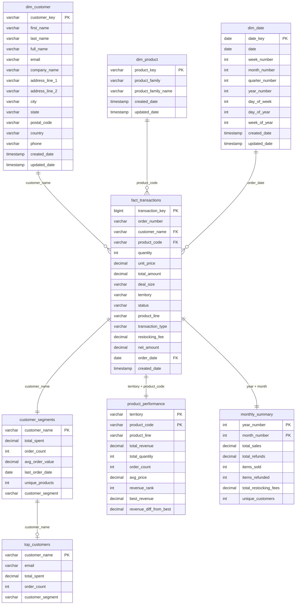

# Entity Relationship Diagram (ERD)

## Psycho Bunny Data Model

This document describes the entity relationship model for the Psycho Bunny data pipeline.

## Tables and Relationships

### Dimension Tables

#### `dim_customer`
- **Primary Key**: `customer_key` (VARCHAR)
- **Description**: Customer master data with deduplication
- **Attributes**:
  - `customer_key`: Unique identifier (composite of name and email)
  - `first_name`: Customer first name
  - `last_name`: Customer last name
  - `full_name`: Concatenated full name
  - `email`: Customer email address
  - `company_name`: Associated company
  - `address_line_1`, `address_line_2`: Address components
  - `city`, `state`, `postal_code`, `country`: Location information
  - `phone`: Contact number
  - `created_date`, `updated_date`: Audit timestamps

#### `dim_product`
- **Primary Key**: `product_key` (VARCHAR)
- **Description**: Product catalog with family classification
- **Attributes**:
  - `product_key`: Product code (e.g., S10_4757)
  - `product_family`: Extracted family code (e.g., S10)
  - `product_family_name`: Human-readable family name
  - `created_date`, `updated_date`: Audit timestamps

**Product Family Mapping**:
- S10: Scale Models
- S12: Motorcycles
- S18: Vintage Cars
- S24: Classic Cars
- S32: Trucks and Buses
- S50: Ships
- S700: Planes

#### `dim_date`
- **Primary Key**: `date_key` (DATE)
- **Description**: Date dimension for time-based analysis
- **Attributes**:
  - `date_key`: Date value
  - `week_number`, `month_number`, `quarter_number`, `year_number`: Time hierarchies
  - `day_of_week`, `day_of_year`, `week_of_year`: Additional time attributes
  - `created_date`, `updated_date`: Audit timestamps

### Fact Tables

#### `fact_transactions`
- **Primary Key**: `transaction_key` (BIGINT)
- **Description**: All sales and refund transactions
- **Foreign Keys**:
  - Links to `dim_customer` via `customer_name`
  - Links to `dim_product` via `product_code`
  - Links to `dim_date` via `order_date`
- **Attributes**:
  - `order_number`: Transaction identifier
  - `customer_name`: Customer reference
  - `product_code`: Product reference
  - `quantity`: Items ordered/refunded
  - `unit_price`: Price per unit
  - `total_amount`: Total transaction value
  - `deal_size`: Business size category
  - `territory`: Geographic region
  - `status`: Transaction status
  - `product_line`: Product line classification
  - `transaction_type`: SALE or REFUND
  - `restocking_fee`: 10% fee for refunds
  - `net_amount`: Amount after fees
  - `order_date`: Transaction date

### Analytics Tables

#### `customer_segments`
- **Primary Key**: `customer_name` (VARCHAR)
- **Description**: Customer segmentation based on spending behavior
- **Attributes**:
  - `total_spent`: Lifetime customer value
  - `order_count`: Number of orders
  - `avg_order_value`: Average order size
  - `last_order_date`: Most recent purchase
  - `unique_products`: Product variety purchased
  - `customer_segment`: High/Medium/Low value classification

#### `product_performance` (Future Segment)
- **Primary Key**: (`territory`, `product_code`)
- **Description**: Product performance metrics by territory
- **Attributes**:
  - `territory`: Geographic region
  - `product_code`: Product identifier
  - `product_line`: Product category
  - `total_revenue`: Revenue generated
  - `total_quantity`: Units sold
  - `order_count`: Number of orders
  - `avg_price`: Average selling price
  - `revenue_rank`: Rank within territory
  - `best_revenue`: Best performer revenue in territory
  - `revenue_diff_from_best`: Revenue gap from top performer

#### `monthly_summary` (Future Segment)
- **Primary Key**: (`year_number`, `month_number`)
- **Description**: Monthly business metrics aggregation
- **Attributes**:
  - `total_sales`: Sales revenue
  - `total_refunds`: Refund amounts
  - `items_sold`: Units sold
  - `items_refunded`: Units refunded
  - `total_restocking_fees`: Fees collected
  - `unique_customers`: Active customers

#### `top_customers` (Future Segment)
- **Primary Key**: `customer_name` (VARCHAR)
- **Description**: Top 10 customers by spending with contact information
- **Attributes**:
  - `email`: Contact email
  - `total_spent`: Total spending
  - `order_count`: Number of orders
  - `customer_segment`: Value classification

## Relationships

## Data Quality Rules (Future Segment)

### Customer Data
- Customer ID must be unique
- Email must be valid format
- Name fields required (>90% completeness)

### Transaction Data
- Order numbers must be unique
- Transaction amounts must be positive
- Product codes must follow pattern (e.g., S10_4757)

### Referential Integrity
- All transactions must have valid customers
- All product codes must exist in product dimension
- All order dates must exist in date dimension

## Business Rules

### Customer Segmentation
- **High Value**: >$50,000 total spending
- **Medium Value**: $10,000-$50,000 total spending
- **Low Value**: <$10,000 total spending

### Refund Processing
- Restocking fee: 10% of refund amount
- Net refund cost = Refund amount - Restocking fee

### Product Classification
- Products grouped by family code prefix
- Territory-based performance ranking
- Cross-sell analysis for product recommendations 
