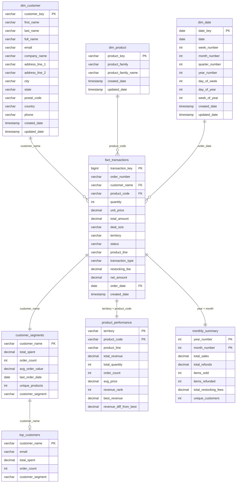

# Project Documentation

## Overview
This document outlines the implementation details of a data pipeline designed to process and integrate data from multiple sources: customer data, transaction data, and fiscal calendar. The objective is to provide a consolidated dataset in Delta Lake format that is optimized for query performance and ready for analytical consumption in data warehouses.

## High-Level Design

### Architecture
The pipeline architecture is built to manage large volumes of data efficiently and effectively, ensuring scalability, availability, and security:

- **Extraction, Loading, and Transformation (ELT)**:
  - Ingest raw customer, transaction, and calendar data into S3 landing and raw zones, with schema validation and partitioning.
  - Transform and load curated data into Delta Lake, Redshift, and Snowflake for fast BI, reporting, and advanced analytics.
- **Data Quality Validation**: Comprehensive validation using PyDeequ framework to ensure data integrity and business rule compliance.
- **Enrichment and Extension**: Data is enhanced with additional computations including customer segmentation, sales analytics, and business metrics.
- **Mitigation of Risks**: Implementing Delta Lake ensures ACID transactions, data versioning, and consistent data across the pipeline.
- **Scalability and Availability**: Leveraging Databricks and Apache Spark to handle varying loads and ensure data availability.
- **Security**: Utilizing AWS IAM roles and policies to manage access and ensure data security across all components.
- **Orchestration and Workflow**: Automated workflows using Apache Airflow to manage the pipeline's lifecycle and handle dependencies.
- **Monitoring**: Comprehensive logging and monitoring through Spark UI, Airflow UI, and AWS CloudWatch.


## Data Pipeline Flow

The data pipeline follows a structured flow through multiple architectural layers, each serving specific purposes in the data processing lifecycle:

### Layer 1: Landing Zone
**Purpose**: Initial data ingestion and as-is data storage
- **Customer Data**: Raw customer information from operational systems
- **Transaction Data**: Real-time transaction records from e-commerce platform
- **Calendar Data**: Fiscal calendar and date dimension data
- **Ingestion Process**: Automated data collection (live streaming or batch) from various source systems
- **Storage**: Amazon S3 buckets with organized folder structure
- **Format**: Original source formats (CSV, JSON, Parquet)

### Layer 2: Raw Zone  
**Purpose**: Centralized raw data storage with partitioned data
- **Storage**: Amazon S3 in delta lake format with standardized naming conventions & partitoned by date
- **Schema Validation**: Schema validation to make sure schema is aligned
- **Data Quality**: Initial data validation and schema checks
- **AWS Glue Data Quality**: Automated data profiling and quality assessment
- **Retention**: Long-term storage for audit and reprocessing requirements

### Layer 3: Processing Zone
**Purpose**: Data transformation, enrichment, and quality validation

#### Processing Components:
- **Databricks**: Distributed data processing using Apache Spark clusters
- **Delta Lake**: ACID-compliant storage layer for processed data
- **Data Quality Validation**: PyDeequ framework for comprehensive quality checks
- **Transformation Logic**: Business rule implementation and data enrichment

#### Processing Flow:
1. **Data Extraction**: Pull data from Raw Zone S3 buckets
2. **Data Quality Checks**: Validate completeness, uniqueness, and business rules
3. **Data Transformation**: Apply business logic and create dimensional models
4. **Data Storage**: Store processed data in Delta Lake format
5. **Data Export**: Prepare data for analytical consumption

### Layer 4: Analytical Consumption
**Purpose**: Multi-platform data delivery for different analytical needs

#### Amazon Redshift (Operational Analytics):
- **Purpose**: Business intelligence and operational reporting
- **Data Model**: Star schema with optimized dimensional tables
- **Use Cases**: Daily reports, dashboards, KPI monitoring
- **Performance**: Columnar storage with distribution keys

#### Snowflake (Future Segment For Advanced Analytics):
- **Purpose**: Data science and advanced analytical workloads
- **Data Model**: Flexible schema supporting complex queries
- **Use Cases**: Machine learning, predictive analytics, data exploration
- **Scalability**: Elastic compute with separation of storage and compute

#### ML & AI Platform:
- **Purpose**: Machine learning model training and deployment
- **Data Access**: Direct connection to Delta Lake and data warehouses
- **Use Cases**: Customer segmentation, demand forecasting, recommendation engines
- **Integration**: Seamless data flow for model training and inference

### Cross-Cutting Concerns

#### Orchestration (Apache Airflow):
- **Workflow Management**: End-to-end pipeline orchestration
- **Dependency Management**: Task scheduling and dependency resolution
- **Error Handling**: Retry logic and failure notifications
- **Monitoring**: Pipeline execution tracking and alerting

#### Monitoring & Logging (Future Segment):
- **DataDog**: Application performance monitoring and log aggregation
- **AWS CloudWatch**: Infrastructure monitoring and alerting
- **Custom Metrics**: Business-specific KPIs and data quality metrics
- **Alerting**: Real-time notifications for pipeline failures and data quality issues

#### Data Governance (Future Segment):
- **Data Lineage**: End-to-end data flow tracking
- **Data Catalog**: Metadata management and data discovery
- **Access Control**: Role-based access to different data layers
- **Compliance**: Data retention policies and audit trails

### Data Flow Summary
```
Customer/Transaction/Calendar Data → Landing Zone (S3) → Raw Zone (S3) → 
Processing Zone (Databricks + Delta Lake) → Analytical Consumption 
(Redshift + Snowflake + ML Platforms) → Analytics & Reporting
```

This layered architecture ensures:
- **Data Integrity**: Each layer validates and enriches data quality
- **Scalability**: Independent scaling of processing and storage components  
- **Flexibility**: Multiple consumption patterns for different analytical needs
- **Reliability**: Fault tolerance and data recovery capabilities
- **Governance**: Comprehensive monitoring and compliance across all layers

## Data Model (ERD Diagram)

[Click Here For More Details](https://github.com/innovacraft/psycho_bunny_pipeline/blob/main/docs/ERD.md) 




### Source Data Schema
- **Customer Data**: customer_id, first_name, last_name, email, phone, address, city, state, zip_code
- **Transaction Data**: transaction_id, customer_id, product_id, product_name, product_family, amount, transaction_date, region
- **Fiscal Calendar**: date, fiscal_year, fiscal_quarter, fiscal_month, fiscal_week

### Target Data Model
- **dim_customer**: Customer dimension with segmentation
- **dim_product**: Product dimension with family groupings
- **dim_calendar**: Date dimension with fiscal attributes
- **fact_transactions**: Transaction facts with calculated measures
- **Analytics Tables**: Pre-aggregated tables for specific business needs
  
### Technologies Used
- **Apache Spark 3.3**: Distributed data processing engine
- **AWS S3**: Cloud object storage for raw and processed data
- **Delta Lake**: Open-source storage layer providing ACID transactions
- **Databricks**: Unified analytics platform for big data and machine learning
- **PyDeequ**: Data quality validation framework built on Apache Spark
- **Apache Airflow 2.7**: Workflow orchestration platform
- **Docker & Docker Compose**: Containerization and orchestration
- **PostgreSQL**: Airflow metadata database
- **Amazon Redshift**: Cloud data warehouse for analytics
- **AWS IAM**: Identity and access management
- **AWS CloudWatch**: Monitoring and logging service

## Detailed Steps

### 1. Data Ingestion
Data is loaded from AWS S3 where raw customer, transaction, and fiscal calendar data reside:
- **Customer Data**: Personal information, contact details, and customer attributes
- **Transaction Data**: Sales transactions with product details, amounts, and timestamps
- **Fiscal Calendar**: Date dimensions for time-based analytics

The ingestion process converts all data to Delta Lake format for optimized storage and query performance.

### 2. Data Quality Validation
Comprehensive data quality checks using PyDeequ framework:
- **Completeness Checks**: Ensuring required fields are not null
- **Uniqueness Validation**: Verifying primary key constraints
- **Data Type Validation**: Confirming correct data types and formats
- **Business Rule Validation**: Custom rules for email formats, positive amounts, and referential integrity
- **Statistical Anomaly Detection**: Identifying outliers and unexpected patterns

### 3. Data Transformation
Multi-stage transformation process creating dimensional and fact tables:
- **Dimension Tables**: Customer, product, and calendar dimensions with slowly changing dimension (SCD) support
- **Fact Table**: Transaction facts with calculated measures and business rules
- **Business Logic Implementation**: 
  - Customer segmentation (High/Medium/Low value based on $10K threshold)
  - Refund processing with 10% restocking fee calculation
  - Large order flagging ($5K threshold)
  - Transaction type classification (Sale/Refund based on amount sign)

### 4. Data Storage and Optimization
The transformed data is stored in Delta Lake with performance optimizations:
- **OPTIMIZE**: Compacting small files for better query performance
- **ZORDER**: Organizing data by frequently queried columns
- **VACUUM**: Removing outdated files beyond retention period
- **Partitioning**: Strategic partitioning by date for time-based queries

### 5. Data Warehouse Loading
Processed data is exported to Amazon Redshift for analytical consumption:
- **Dimensional Model**: Star schema with proper relationships
- **Data Types**: Optimized data types for Redshift performance
- **Compression**: Column compression for storage efficiency
- **Distribution Keys**: Proper distribution for join performance

### 6. Analytics Generation
Creation of pre-aggregated analytics tables for BI consumption:
- **Sales Analytics**: Weekly, monthly, quarterly sales summaries
- **Refunds Analytics**: Refund tracking with restocking fees
- **Product Analytics**: Product family sales rankings
- **Regional Analytics**: Geographic performance comparisons
- **Customer Analytics**: Customer segmentation and top spender analysis

## Data Quality Framework

### Validation Rules
1. **Completeness**: All required fields must be populated
2. **Uniqueness**: Primary keys must be unique across datasets
3. **Referential Integrity**: Foreign key relationships must be valid
4. **Data Format**: Email addresses must follow valid format patterns
5. **Business Rules**: Transaction amounts must be positive, customer IDs must exist
6. **Statistical Checks**: Data distribution analysis for anomaly detection

### Error Handling
- **Validation Failures**: Detailed logging of all validation failures
- **Data Quarantine**: Invalid records are isolated for manual review
- **Pipeline Continuation**: Non-critical failures allow pipeline to continue
- **Alerting**: Email notifications for critical data quality issues

## Performance Optimization (Future Segment)

### Query Performance
- **Delta Lake Optimization**: Regular OPTIMIZE and ZORDER operations
- **Partitioning Strategy**: Date-based partitioning for time-series queries
- **Caching**: Strategic caching of frequently accessed datasets
- **Broadcast Joins**: Optimizing joins for small dimension tables

### Resource Management
- **Spark Configuration**: Optimized Spark settings for cluster resources
- **Dynamic Scaling**: Auto-scaling based on workload demands
- **Memory Management**: Proper memory allocation for large datasets
- **Parallel Processing**: Maximizing parallelism for data transformations

## Monitoring and Alerting

### Pipeline Monitoring
- **Airflow UI**: Visual monitoring of DAG execution and task status
- **Spark UI**: Detailed job and stage execution metrics
- **CloudWatch**: AWS resource utilization and performance metrics (Future Segment)
- **Custom Logging**: Application-specific logging for troubleshooting

### Alerting Strategy (Future Segment)
- **Email Notifications**: Immediate alerts for pipeline failures
- **Data Quality Alerts**: Notifications for validation threshold breaches
- **Performance Alerts**: Warnings for unusual execution times
- **Resource Alerts**: Notifications for resource constraint issues

## Security and Compliance 

### Access Control
- **IAM Roles**: Principle of least privilege for all AWS resources
- **Databricks Security**: Workspace-level access controls
- **Data Encryption**: Encryption at rest and in transit
- **Audit Logging**: Comprehensive audit trails for all data access

### Data Privacy
- **PII Protection**: Proper handling of personally identifiable information
- **Data Masking**: Sensitive data masking in non-production environments
- **Retention Policies**: Automated data retention and purging
- **Compliance**: Adherence to data protection regulations

## Deployment and Operations

### Environment Management
- **Configuration Management**: Environment-specific configuration files
- **Version Control**: Git-based version control for all pipeline code
- **CI/CD Pipeline**: Automated testing and deployment processes
- **Environment Promotion**: Structured promotion from dev to production

### Operational Procedures
- **Backup and Recovery**: Regular backups and disaster recovery procedures
- **Maintenance Windows**: Scheduled maintenance for system updates
- **Capacity Planning**: Proactive capacity planning for growth
- **Documentation**: Comprehensive operational documentation

## Future Enhancements

### Planned Improvements
- **Real-time Processing**: Migration to streaming data processing
- **Advanced Analytics**: Integration of machine learning models
- **Data Catalog**: Implementation of comprehensive data cataloging
- **Multi-cloud Support**: Extension to additional cloud providers

### Scalability Considerations
- **Data Volume Growth**: Architecture designed for 10x data growth
- **User Base Expansion**: Support for increased concurrent users
- **Geographic Expansion**: Multi-region deployment capabilities
- **Technology Evolution**: Flexibility for technology stack updates

## Conclusion
This pipeline ensures that the data processed is ready for analytical querying, adhering to best practices in data engineering, data quality, and pipeline design. The solution provides a robust foundation for business intelligence and analytics, enabling the organization to derive meaningful insights efficiently while maintaining high standards of data quality and operational excellence. 
